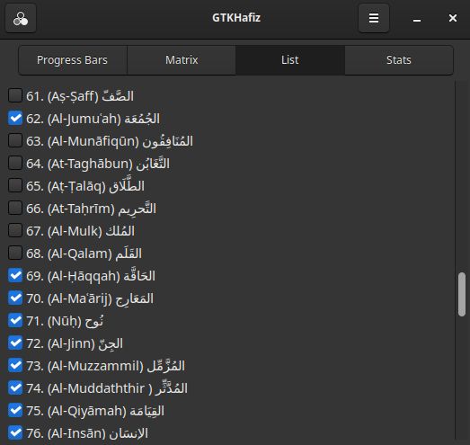
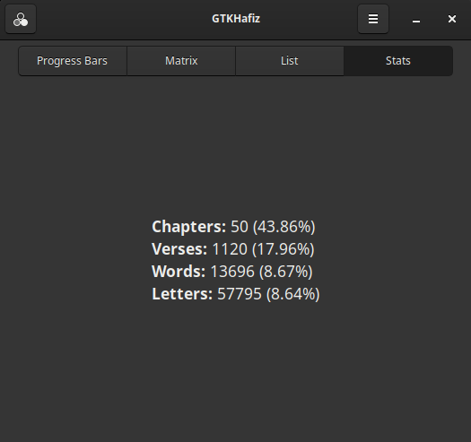
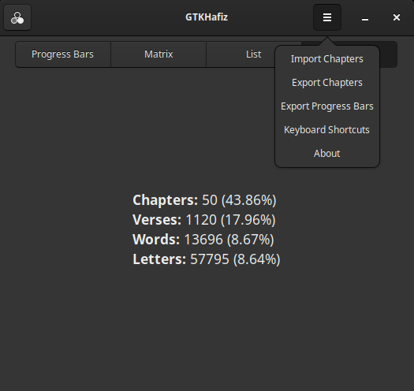

# GTKHafiz

GTKHafiz is a simple GTK 3 based app to track Quran memorization visually.

<p align="center" width="100%">





</p>

## Requirements
This GTK 3 based app uses [PyGObject](https://pygobject.gnome.org/), which is a Python package that provides bindings for GObject based libraries such as GTK, GStreamer, WebKitGTK, GLib, GIO and many more.

The dependencies usually come pre-installed on popular Linux distributions, however some do not come with the package python3-gi-cairo installed by default.

If you wish to configure on other operating systems, including Windows, follow the instructions on the [PyGObject website](https://pygobject.gnome.org/getting_started.html), making sure to replace the GTK 4 packages with the corresponding GTK 3 ones on installation.

## Install the app on Linux
```sh
sudo scripts/install.sh
```
After installing, you can launch the app from the application menu of your desktop environment or run:
```sh
gtkhafiz
```

## Uninstall the app
```sh
sudo scripts/uninstall.sh
```

## Credits
- Data source: [Quran Analysis](https://qurananalysis.com/analysis/basic-statistics.php?lang=EN)
- Inspiration: [ColorArabic](https://commons.wikimedia.org/wiki/File:ColorArabic.png)
