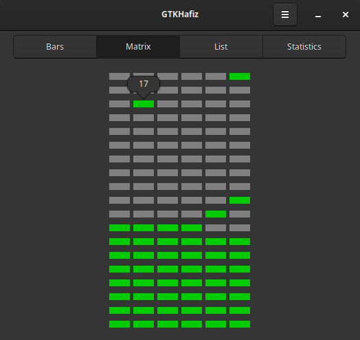
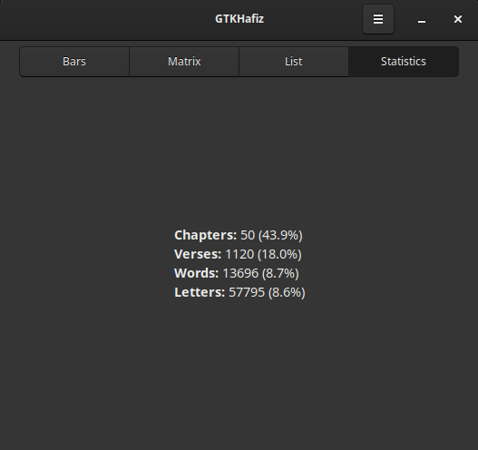

# GTK Hafiz

GTK Hafiz is a simple GTK 3 app to track Qur'an memorization visually.

<p align="center" width="100%">




</p>

## Requirements
This GTK 3 app was made using [PyGObject](https://pygobject.gnome.org/), which is a Python package that provides bindings for GObject based libraries such as GTK, GStreamer, WebKitGTK, GLib, GIO and many more.

The dependencies usually come pre-installed on popular Linux distributions, such as Debian, Mint and Fedora, except on newer versions of Ubuntu - which might not come with the 'python3-gi-cairo' package by default.

To install them on Debian-based distributions:
```bash
sudo apt install python3-gi python3-gi-cairo python3-cairo gir1.2-gtk-3.0
```
To configure on other operating systems, including Windows, follow the instructions on the [PyGObject website](https://pygobject.gnome.org/getting_started.html), making sure to replace 'GTK4' with 'GTK3' when instaling packages.

## Run the App:
```bash
python3 main.py
```

## Reset the Database:
The database setup is made using the sqlite3 CLI via a Bash script.

To install the sqlite3 CLI on Debian-based distributions:
```bash
sudo apt install sqlite3
```
Run the Bash Script:
```bash
bash setup_db.sh
```

## Credits
- Data source: [Quran Analysis](https://qurananalysis.com/analysis/basic-statistics.php?lang=EN)
- Progress bar inspiration: [ColorArabic](https://commons.wikimedia.org/wiki/File:ColorArabic.png)

