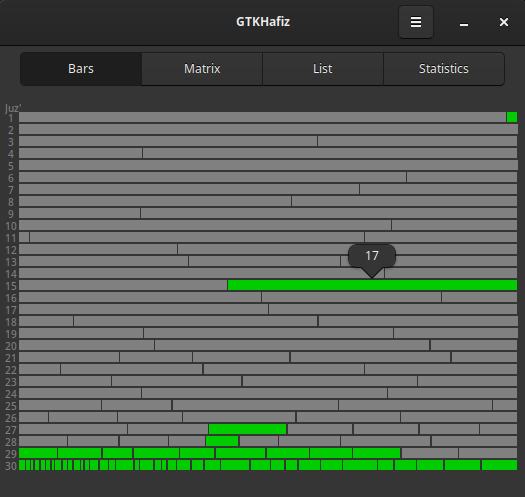

# GTK Hafiz: Track Qur'an memorization visually

<p align="center" width="100%">



</p>

## Requirements
This GTK 3 app was made using PyGObject, which is a Python package that provides bindings for GObject based libraries such as GTK, GStreamer, WebKitGTK, GLib, GIO and many more.

The dependencies usually come pre-installed on popular Linux distributions, such as Debian, Mint and Fedora, except Ubuntu 24 and 25 - which may not come with the 'python3-gi-cairo' package by default.

To install them on Debian-based distributions:
```bash
sudo apt install python3-gi python3-gi-cairo python3-cairo gir1.2-gtk-3.0
```

## Run the App:
```bash
python3 main.py
```

## Reset the Database:
The database setup is made using the sqlite3 CLI via a Bash script.

To install the sqlite3 CLI on Debian-based distributions:
```bash
sudo apt install sqlite3
```
Run the Bash Script:
```bash
bash setup_db.sh
```
